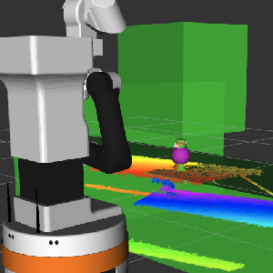

# Grasping Package

This is the new grasping package.

**Demo Video**: <https://youtu.be/o2ponm9aaUk>

## File Structure

    grasping/
    ├── launch/
    |   └── add_objects.launch
    ├── scripts/
    |   ├── grasp.py
    |   ├── object_inserter.py
    |   ├── planning_grasp.py
    |   └── table_inserter.py
    ├── src/
    |   └──  grasp2.cpp
    └── README.md

## Key features

- `grasp2.cpp`: The latest grasping pipeline written in C++, supporting Cartesian path planning. This version was used to record the demo video.

- `grasp.py`: The previous Python-based version of the grasping pipeline, still functional but now superseded by `grasp2.cpp`.

- `object_inserter.py`: Performs shape completion and center estimation from object point clouds. Also adds multiple virtual obstacles around the object to guide the arm toward a desirable grasping approach.

- `table_inserter.py`: Adds the table as a collision object to `Planning Scene` of `MoveIt`to prevent the collision.

- `planning_grasp.py`: An experimental script for grasp planning. The implementation is still in progress and currently not maintained.

## Usage

Requires `plane_segmentation` and `object_labeling` nodes to be running.

    roslaunch grasping add_object.launch

    rosrun grasping grasping_node

## Example

🟣 The purple sphere indicates the center of the completed object shape.

🟢 The green part shows the obstacles added to the `Planning Scene`.

## TODO

- **Multi-object grasping**: Enable multi-object detection and grasping, potentially by integrating the `SAM` or `YOLOv8-segmentation` model. Use the segmentation mask to project onto the point cloud and select the desired grasp target.

- **Improve end-effector orientation**: Currently, the end-effector is fixed to face the positive x-axis during grasping, which limits trajectory flexibility. Dynamically adjusting the gripper to face the object could enable more natural and robust grasps from various angles. Integration with `GPD (Grasp Pose Detection)` is also under consideration.

- **Robot pose adjustment**: Estimate the straight-line distance from the object to the robot’s `base_link`, and move the robot to an appropriate position and orientation before initiating the grasp. This ensures that the target is within optimal reach and field of view.
